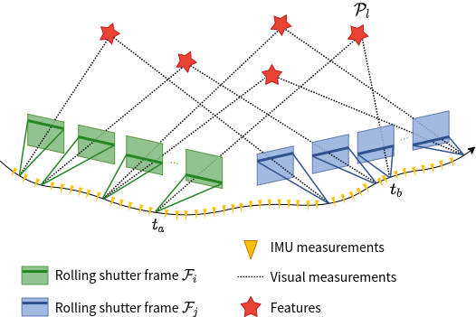

# Ctrl-VIO

**Ctrl-VIO: Continuous-Time Visual-Inertial Odometry for Rolling Shutter Cameras**

 

Ctrl-VIO is a highly-accurate continuous-time visual-inertial odometry system with online calibration for the line exposure time difference (line delay) of the rolling shutter cameras , using continuous-time trajectory parameterized by B-splines to elegantly handle the rolling shutter effect, which outperforms SOTA global shutter method VIO and rolling shutter method VIO on rolling shutter data. A novel marginalization strategy for continuous-time framework is proposed and implemented.

### Prerequisites

- ROS (tested with Melodic)

- Eigen3

- Ceres 1.14

- OpenCV 3.3

- yaml-cpp

  ```shell
  sudo apt-get install libyaml-cpp-dev
  ```


### Install

```shell
mkdir -p ~/catkin_ctrlvio/src
cd ~/catkin_ctrlvio/src
git clone https://github.com/APRIL-ZJU/Ctrl-VIO.git
cd ~/catkin_ctrlvio
catkin_make
source devel/setup.bash
```

### Example

- Download [TUM-RSVI Dataset](https://cvg.cit.tum.de/data/datasets/rolling-shutter-dataset).

- Configure parameters in the `config/ct_odometry_tumrs.yaml` file.

  - `log_path`: the path to log 
  - `config_path`: the path of `config` folder 
  - `bag_path`: the file path of rosbag  

- Run on TUM-RSVI Dataset for example.

  ```shell
  roslaunch ctrlvio odometry.launch
  ```


 

### Credits

This code was developed by Xiaolei Lang and Jiajun Lv from [APRIL Lab](https://april.zju.edu.cn/) in Zhejiang University.

For researchers that have leveraged or compared to this work, please cite the following:

```latex
@article{lang2022ctrl,
  title={Ctrl-vio: Continuous-time visual-inertial odometry for rolling shutter cameras},
  author={Lang, Xiaolei and Lv, Jiajun and Huang, Jianxin and Ma, Yukai and Liu, Yong and Zuo, Xingxing},
  journal={IEEE Robotics and Automation Letters},
  volume={7},
  number={4},
  pages={11537--11544},
  year={2022},
  publisher={IEEE}
}
```

### Acknowledgement

- The spline module is adapted from [basalt](https://gitlab.com/VladyslavUsenko/basalt-headers).
- The visual module is adapted from [VINS-Mono](https://github.com/HKUST-Aerial-Robotics/VINS-Mono).

Thanks for their excellent job!

### Licence

The code is released under the [GNU General Public License v3 (GPL-3)](https://www.gnu.org/licenses/gpl-3.0.txt).
