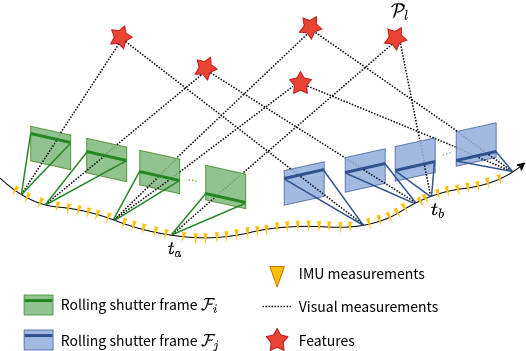
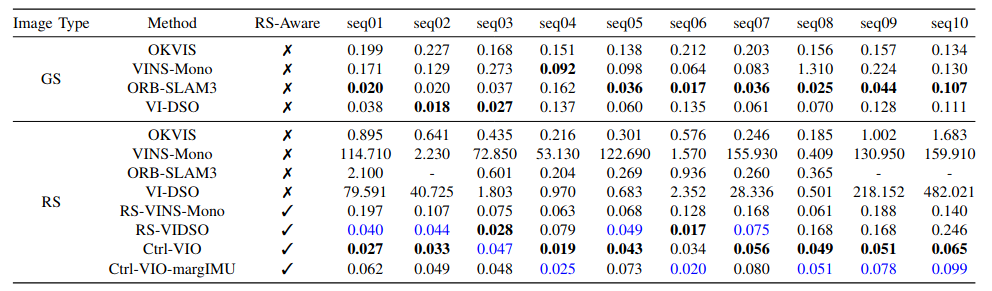

# Ctrl-VIO

Ctrl-VIO: Continuous-Time Visual-Inertial Odometry for Rolling Shutter Cameras

**Ctrl-VIO** is a highly-accurate continuous-time visual-inertial odometry system with online calibration for  the line exposure time difference (line delay) of the rolling shutter cameras , using continuous-time trajectory parameterized by B-splines to elegantly handle the rolling shutter effect, which outperforms SOTA global shutter method VIO and rolling shutter method VIO on rolling shutter data. A novel marginalization strategy for continuous-time framework is proposed and implemented.

The source code will be available after the publication of the related paper.

## Evaluation on TUM-RSVI Dataset

[YouTube](https://youtu.be/fr-Eu74Tqsw)

 

The RMSE(m) of APE results of GS methods on GS data, and both GS methods and RS methods on RS data in [TUM-RSVI Dataset](https://vision.in.tum.de/data/datasets/rolling-shutter-dataset). The best results are marked in bold and the second best results are marked in blue.

